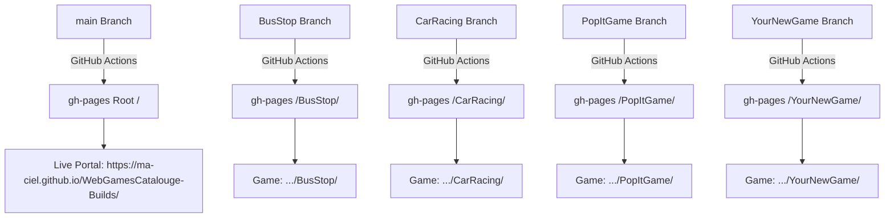

# 🎮 CIEL WebGames - Deployment Guide

This guide explains how games are hosted, how GitHub Actions deploys them, and how to add any new Unity WebGL game to the catalog portal in just a few minutes.

---

## 🏛️ How the System Works (Architecture)



### The 2 Key Components:
1. **The Game Branches** (`BusStop`, `CarRacing`, `PopItGame`, etc.):
   - Holds the Unity WebGL build files (`Build/`, `TemplateData/`, `index.html`, etc.).
   - Whenever you push to a game branch, GitHub Actions automatically deploys it into a subfolder named after the branch on `gh-pages`!
   - Example: Push to `PopItGame` ➔ Live at `.../PopItGame/`.

2. **The Portal (`main` branch)**:
   - Holds the catalog home page (`index.html`, `portal.css`, `portal.js`, `games.json`, and `assets/` thumbnails).
   - Whenever you push to `main`, GitHub Actions deploys the main portal home page to the root.

---

## 🚀 3-Step Guide to Deploy a New Game

### Step 1: Export from Unity
In Unity:
1. Go to **File ➔ Build Settings...**
2. Switch platform to **WebGL**.
3. Open **Player Settings ➔ Publishing Settings**:
   - **Compression Format**: **Disabled**.
   - **Decompression Fallback**: Unchecked.
   - **Data Caching**: Checked (repeat visits load from the browser cache).

   > **Why Disabled?** GitHub Pages cannot send the `Content-Encoding` header that
   > Unity's `.br` / `.gz` files need, so Unity has to unzip them in JavaScript,
   > which is slow (especially on phones). Uncompressed files are gzipped by GitHub
   > Pages automatically and unzipped natively by the browser, and the `.wasm`
   > compiles while it downloads.
   >
   > Every file must stay under GitHub's **100MB** limit. If `.data` goes over,
   > shrink the build (see below).
4. Open **Player Settings ➔ Other Settings** to make the build smaller:
   - **Managed Stripping Level**: **High** (test the game afterwards).
   - **IL2CPP Code Generation**: **Optimize for code size and build time**.
   - **Strip Engine Code**: Checked.
5. In **Build Profiles ➔ WebGL**, set **Code Optimization** to **Disk Size with LTO**.
6. Keep assets small: texture **Max Size** 1024 (512 for UI/small props) with
   **Crunch Compression**, audio as **Vorbis** at a lower quality, and remove
   unused scenes/assets from the build.
7. Click **Build** and choose an export folder on your computer.

---

### Step 2: Create Game Branch & Copy Build
In your terminal, navigate to this repo:

```bash
# 1. Checkout a new branch for the game (e.g. CandyMatch)
git checkout main
git pull origin main
git checkout -b CandyMatch

# 2. Copy the exported Unity build files into this repository root:
# Your repository root must contain:
#   ├── Build/
#   │   ├── WebGL.data
#   │   ├── WebGL.framework.js
#   │   ├── WebGL.loader.js
#   │   └── WebGL.wasm
#   ├── TemplateData/
#   ├── index.html
#   └── game-config.json
```

---

### Step 3: Deploy the Game Branch

You can use the helper script:
```bash
./deploy-game.sh CandyMatch
```

Or run manually:
```bash
git add -A
git commit -m "Deploy CandyMatch WebGL build"
git push -u origin CandyMatch
```

> ⏱️ **Wait 1-2 minutes** for GitHub Actions to deploy.  
> Your game is now live at:  
> `https://ma-ciel.github.io/WebGamesCatalouge-Builds/CandyMatch/`

---

## 🖼️ Step 4: Add the Game Card to the Main Portal

Once the game is deployed, register it in the catalog:

1. **Switch to `main` branch**:
   ```bash
   git checkout main
   git pull origin main
   ```

2. **Add a thumbnail** in the `assets/` folder:
   - Recommended size: `1280x720` (16:9 ratio, JPG or PNG)
   - Example filename: `assets/candy-match.jpg`

3. **Add an entry to [`games.json`](./games.json)**:
   ```json
   {
     "id": "candy-match",
     "title": "Candy Match 3D",
     "category": "Casual",
     "branch": "CandyMatch",
     "path": "./CandyMatch/",
     "thumbnail": "./assets/candy-match.jpg",
     "rating": "4.9",
     "plays": "5.4K",
     "featured": false,
     "orientation": "portrait",
     "description": "Match sweet treats and clear puzzles in this relaxing 3D match-3 adventure!"
   }
   ```
   > **Note on `path`:** Always format as `./<BranchName>/` with trailing slash!

4. **Commit & Push `main`**:
   ```bash
   git add games.json assets/candy-match.jpg
   git commit -m "Add Candy Match 3D to portal catalog"
   git push origin main
   ```

🎉 Within 1-2 minutes, the game will appear live on the portal:  
👉 **`https://ma-ciel.github.io/WebGamesCatalouge-Builds/`**

---

## 🛠️ Common Issues & Fixes

| Issue | Cause | Fix |
|---|---|---|
| **Game shows 404** | Wrong URL path (e.g. `Game/Game/`) | Use `https://ma-ciel.github.io/WebGamesCatalouge-Builds/<BranchName>/` |
| **Build files missing on GitHub** | Ignored by `.gitignore` | `.gitignore` has been updated to allow `Build/`. You can also run `git add -f Build/` |
| **Push rejected (file > 100MB)** | Build too large | Shrink textures/audio (Step 1). As a last resort use **Brotli** with **Decompression Fallback** checked — it loads slower. |
| **Game loads slowly** | Compressed `.br`/`.gz`/`.unityweb` build on GitHub Pages | Rebuild with **Compression Format: Disabled** (Step 1). |
| **New game card not appearing on portal** | Browser cache | Hard refresh with `Ctrl + Shift + R` (or `Cmd + Shift + R`). `portal.js` also now has automated cache-busting. |
| **Black screen / Loading error** | Missing `.nojekyll` | Ensure `.nojekyll` exists on `gh-pages` so GitHub doesn't ignore underscore/dot files. |
